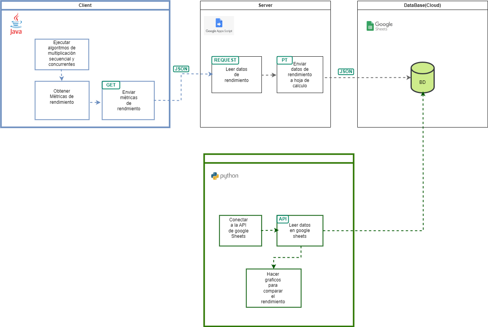

# Proyecto de Multiplicación de numeros en arreglos en Java

Este proyecto usan las siguientes tecnologias:

- Java
- Appsscript
- Google Sheets
- Python - Pandas - Numpy - matplotlib

El objetivo de este proyecto es implementar diferentes algoritmos de multiplicación de numeros en arreglos para analizar su rendimiento a través de gráficas.
Entre los algoritmos implementados están secuenciales. 

En el siguiente diagrama de componentes se puede observar las relaciones entre las partes que hacen parte del proyecto

